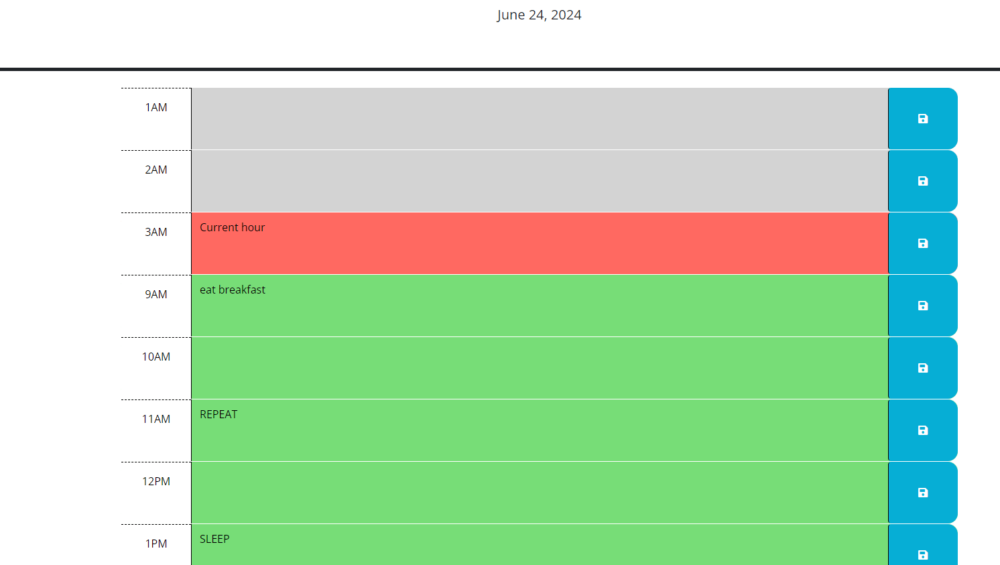

# Workday-Scheduler

## description
- This application will help you keep track of things to do with scheduling functionality, allowing you to keep track of the time and day aswell with color !

## instalation
- git clone this repo at https://github.com/Edesp1/Workday-Scheduler
- right click on index.html and run in default browser or browser of your choice and you are good to use this application
- NOTE : YOU CAN ALSO VIEW IT IN YOUR BROWSER WITHOUT CLONING BY CLICKING ON THIS LINK - https://edesp1.github.io/Workday-Scheduler/ 
## usage

## contributions
- contributions are currently closed

## license
- this application is under the MIT license

## future add-ons
- will add an easier method of removing the scheduled notes other than simply erasing and clicking save